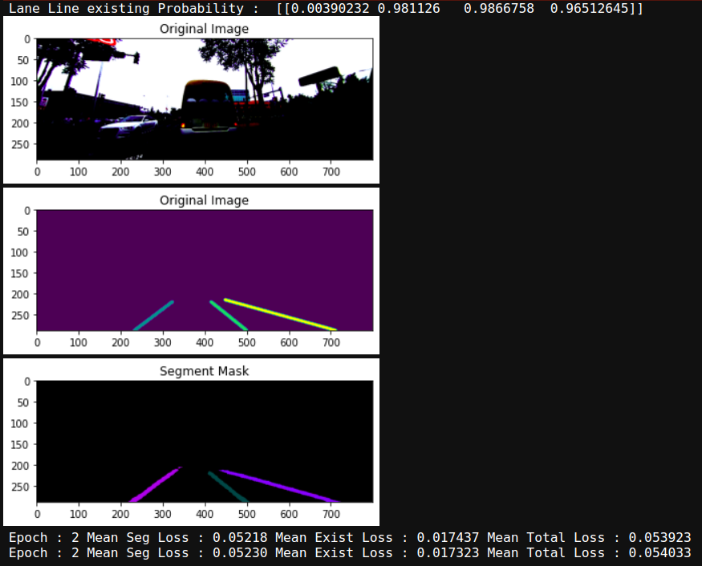
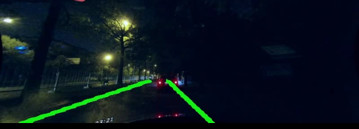
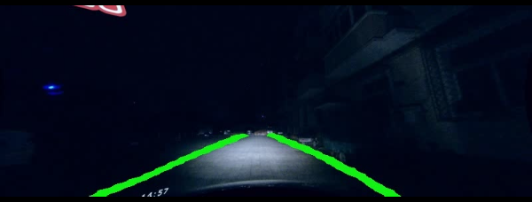
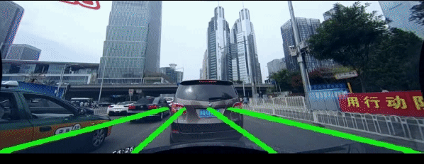

# **Lane Line Detection** 


### Below is the depth review of my lane line detection project based on  [CULane](https://xingangpan.github.io/projects/CULane.html) data set .

---

**Build the Lane Line Detection  Project**

The goals / steps of this project are the following:
* Load the data set (see below for links to the project data set)
* Explore, summarize and visualize the data set
* Design, train and test a model architecture
* Use the model to make predictions on new images

---


### Data Set Summary & Exploration

#### 1. Provide some samples from the original data set .


### Design and Test a Model Architecture


#### 3. [SPATIAL CONVOLUTIONAL NEURAL NETWORK](https://arxiv.org/abs/1712.06080) .


 


#### 4. Model Training Results


 

### Test the Model Performance

#### 1. Test out the model with some challenging  situations like extream dark conditions , occlusions due to the vehicles which even human wouldn't be able to recognize the lane lines  . Robustness under extream dark conditions show promising results than using basic feature engineering . 




* Gif showing results on test set


### Run the notebook your self

1. Download the data set [CULane ](https://xingangpan.github.io/projects/CULane.html) . This is a image dataset . It contains a training, validation and test set with ground truth data .
2. Clone the project, which contains the Ipython notebook and the utility python scripts .
```sh
git clone https://github.com/himasha0421/Lane-Line-Detection.git
cd Lane-Line-Detection
jupyter notebook CULane_final.ipynb
```